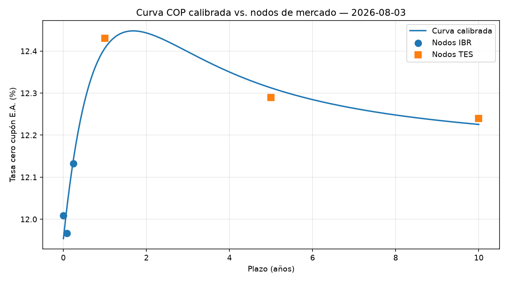
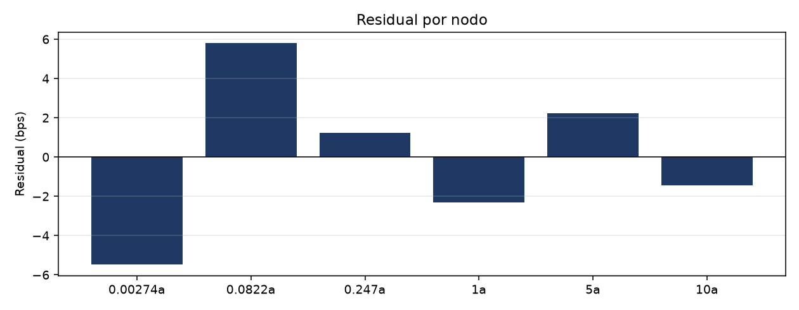
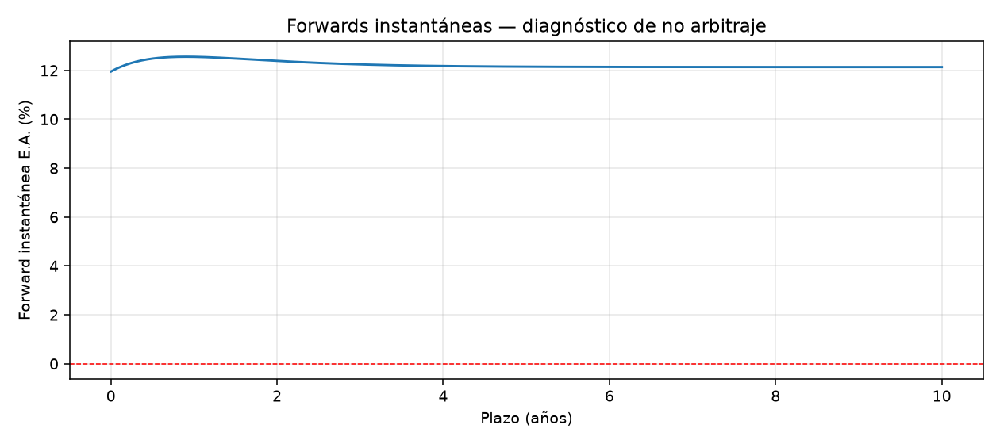

# Reporte de validación

Generado 2026-08-04T13:55:25+00:00

| Insumo | Valor | Fecha del dato |
|---|---|---|
| Curva COP (último nodo) | — | 2026-08-03 |
| TRM contado | 3,230.44 COP/USD | 2026-08-04 |
| SOFR | 3.6500% | 2026-08-03 |

Las tres fechas pueden no coincidir: cada fuente tiene su propio calendario de publicación. Se muestran por separado para que cualquier desalineación quede a la vista en vez de esconderse bajo una única fecha de reporte.

## Procedencia de los datos

| fuente | origen | filas | sha256 | descargado |
|---|---|---|---|---|
| suameca_serie_1 | api | 1 | c1e117dea04ffa19 | 2026-08-04T13:55:24+00:00 |
| nyfed_sofr | api | 5 | ea003ba33000be19 | 2026-08-04T13:55:25+00:00 |
| suameca_serie_241 | api | 10 | af92f3b7b734e9e7 | 2026-08-04T13:55:22+00:00 |
| suameca_serie_242 | api | 10 | ab56456eaf7e8a4c | 2026-08-04T13:55:23+00:00 |
| suameca_serie_243 | api | 10 | b660923bb286b535 | 2026-08-04T13:55:23+00:00 |
| suameca_serie_239 | api | 10 | a8b8b9fae52d4772 | 2026-08-03T15:15:12+00:00 |
| suameca_serie_240 | api | 10 | 2ed43aa177fc9aac | 2026-08-03T15:15:12+00:00 |
| curva_cero_cupon_tes_pesos | manual_export | 5735 | d1180ebcec16a62e | 2026-08-04T13:55:23+00:00 |

`origen = manual_export` marca lo que aportó una persona porque no existe API que lo entregue. Todo lo demás se descargó automáticamente.

## Calibración

```
NS (4p) | RMSE=3.599 bps | max|residual|=5.795 bps | nodos=6 | gl=2 | convergió=True
```

| plazo_anios | fuente | tasa_mercado | tasa_ajustada | residual_bps |
|---|---|---|---|---|
| 0.00274 | IBR | 12.0087% | 11.9538% | -5.487 |
| 0.082192 | IBR | 11.9664% | 12.0244% | 5.795 |
| 0.246575 | IBR | 12.1323% | 12.1445% | 1.225 |
| 1.0 | TES | 12.4300% | 12.4068% | -2.322 |
| 5.0 | TES | 12.2900% | 12.3124% | 2.241 |
| 10.0 | TES | 12.2400% | 12.2255% | -1.452 |





## Diagnóstico de no arbitraje

```
No arbitraje: OK | forwards negativas=0 | DF monótono=True | max|z''|=0.0143
```



## Comparación NS vs. Svensson

| modelo | grados_libertad | rmse_bps | max_curvatura |
|---|---|---|---|
| Nelson-Siegel (4p) | 2 | 3.599 | 0.0143 |
| Svensson (6p) | 0 | 0.0 | 0.3377 |

Con 6 nodos, Svensson queda sin grados de libertad: el RMSE nulo está garantizado por construcción y la curva pierde suavidad. Por eso el modelo por defecto es Nelson-Siegel.

## Benchmark contra QuantLib

| magnitud | detalle | propio | quantlib | desvío | estado |
|---|---|---|---|---|---|
| factor_descuento | 30d | 0.9907108372 | 0.9907108372 | 0 | OK |
| factor_descuento | 90d | 0.9721335872 | 0.9721335872 | 0 | OK |
| factor_descuento | 180d | 0.9445120455 | 0.9445120455 | 1.11e-16 | OK |
| factor_descuento | 360d | 0.8910685617 | 0.8910685617 | 1.11e-16 | OK |
| factor_descuento | 720d | 0.7934582137 | 0.7934582137 | 0 | OK |
| factor_descuento | 1825d | 0.5595786962 | 0.5595786962 | 1.11e-16 | OK |
| factor_descuento | 3650d | 0.3155624543 | 0.3155624543 | 0 | OK |
| valor_presente | cupón 13.25%, 7a, 1x/año | 104.3326883 | 104.3324827 | 1.97e-06 | OK |
| dv01 | cupón 13.25%, 7a, 1x/año | 0.04661884688 | 0.04664485853 | 0.000558 | OK |
| duracion_macaulay | cupón 13.25%, 7a, 1x/año | 5.017519653 | 5.016651188 | 0.000173 | OK |
| forward_usdcop | 30d | 3250.841471 | 3250.841471 | 0 | OK |
| forward_usdcop | 90d | 3292.992681 | 3292.992681 | 0 | OK |
| forward_usdcop | 180d | 3358.920767 | 3358.920767 | 1.35e-16 | OK |
| forward_usdcop | 360d | 3497.689485 | 3497.689485 | 1.3e-16 | OK |
| forward_usdcop | 720d | 3794.35444 | 3794.35444 | 0 | OK |

Los factores de descuento y los forwards coinciden a precisión de máquina. El desvío del bono proviene de que este motor ubica los flujos en fracciones de año exactas mientras QuantLib usa calendario real: los cupones de períodos bisiestos valen 366/365 y los flujos caen unos días más tarde. Son dos efectos de signo opuesto, y por eso el signo neto cambia con el plazo.

## Forwards USD/COP

| plazo_dias | forward | puntos | devaluacion_ea | dv01_cop | dv01_usd | theta_dia | brecha_conv_bps | extrapolado |
|---|---|---|---|---|---|---|---|---|
| 30 | 3,250.84 | +20.40 | 7.96% | 0.0239 | -0.027 | 0.6827 | 6.38 | no |
| 60 | 3,271.71 | +41.27 | 8.03% | 0.048 | -0.0542 | 0.6932 | 11.89 | no |
| 90 | 3,292.99 | +62.55 | 8.09% | 0.0724 | -0.0816 | 0.7032 | 16.49 | no |
| 180 | 3,358.92 | +128.48 | 8.23% | 0.1475 | -0.1649 | 0.7308 | 24.7 | sí |
| 270 | 3,427.33 | +196.89 | 8.33% | 0.2257 | -0.2502 | 0.7556 | 24.47 | sí |
| 360 | 3,497.69 | +267.25 | 8.39% | 0.3069 | -0.3375 | 0.7784 | 16.03 | sí |
| 540 | 3,643.15 | +412.71 | 8.47% | 0.4793 | -0.5181 | 0.8206 | -23.73 | sí |
| 720 | 3,794.35 | +563.91 | 8.50% | 0.6656 | -0.7072 | 0.8607 | -90.68 | sí |

`extrapolado = sí` marca los plazos que exceden el último nodo automatizado (90 días de IBR): ahí la tasa COP sale de proyectar la forma paramétrica, no de interpolar entre datos observados.

## Riesgo del bono de referencia

Bono cupón 13.25%, 7 años, 1 pago(s) por año, nominal 100.

- Valor presente: **104.3327**
- DV01: **0.046619** por 100 de nominal
- Duración modificada: **4.4683** años

Este bono es ilustrativo. No hay fuente pública gratuita de reference data de TES, así que cupón y vencimiento deben verificarse contra Infovalmer o la BVC antes de usarse para valorar una posición real.

## Suite de pruebas

```
============================= test session starts ==============================
collected 96 items

tests/test_benchmark_quantlib.py ..............                          [ 14%]
tests/test_curva_nss.py ..............................................   [ 62%]
tests/test_pricer_forward.py ....................................        [100%]

============================== 96 passed in 2.32s ==============================
```
