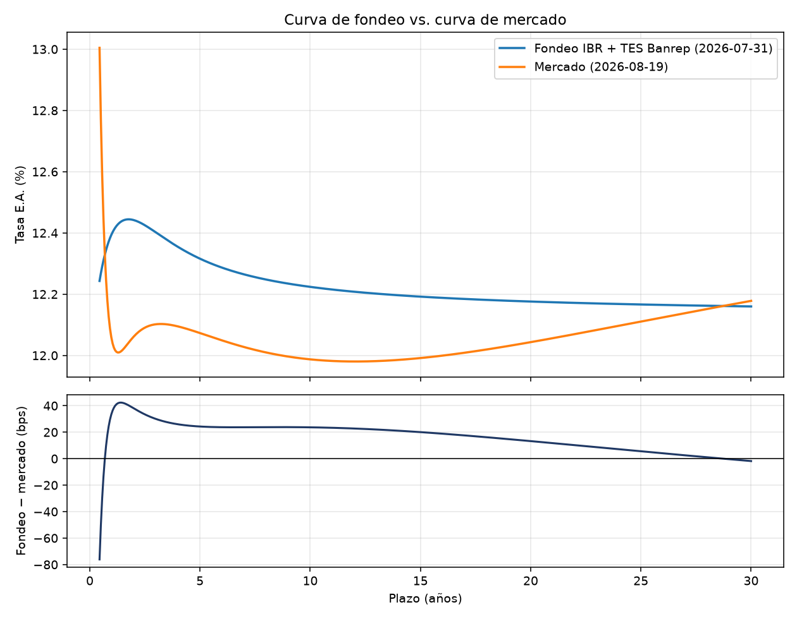

# Reporte de validación

Generado 2026-08-20T17:02:40+00:00

| Insumo | Valor | Fecha del dato |
|---|---|---|
| Curva de fondeo (IBR + TES Banrep) | nodo más viejo | 2026-07-31 |
| Curva de mercado (precios) | insumo más viejo | 2026-08-18 |
| TRM contado | 3,053.48 COP/USD | 2026-08-20 |
| SOFR | 3.6200% | 2026-08-19 |

**Fecha de la corrida: 2026-07-31.** Es la del insumo más viejo de todos, no la del más nuevo: una curva es tan fresca como el dato más rancio que la alimenta. El insumo más reciente es del 2026-08-20, o sea una dispersión de 20 días.

Las fechas no tienen por qué coincidir: cada fuente tiene su propio calendario de publicación. Se muestran por separado para que cualquier desalineación quede a la vista en vez de esconderse bajo una única fecha de reporte.

## Procedencia de los datos

| fuente | origen | licencia | filas | sha256 | descargado |
|---|---|---|---|---|---|
| suameca_serie_1 | api | abierta | 1 | 8e978ce19cf84bd9 | 2026-08-20T17:02:40+00:00 |
| nyfed_sofr | api | abierta | 5 | 8e437f27bce6590e | 2026-08-20T17:02:40+00:00 |
| suameca_serie_241 | api | abierta | 10 | 76b5ec2597698719 | 2026-08-20T17:02:38+00:00 |
| suameca_serie_242 | api | abierta | 10 | cbd1939fbc171de4 | 2026-08-20T17:02:38+00:00 |
| suameca_serie_243 | api | abierta | 10 | 07ed748355d5a4f6 | 2026-08-20T17:02:39+00:00 |
| suameca_serie_239 | api | abierta | 10 | a8b8b9fae52d4772 | 2026-08-03T15:15:12+00:00 |
| suameca_serie_240 | api | abierta | 10 | 2ed43aa177fc9aac | 2026-08-03T15:15:12+00:00 |
| curva_cero_cupon_tes_pesos | manual_export | abierta | 5735 | d1180ebcec16a62e | 2026-08-20T17:02:39+00:00 |
| cotizaciones_tes | manual_export | restringida | 15 | fb52a787561308c3 | 2026-08-20T17:02:39+00:00 |

`origen = manual_export` marca lo que aportó una persona porque no existe API que lo entregue. Todo lo demás se descargó automáticamente.

`licencia = restringida` marca una fuente que **no se versiona**: los precios vienen de un proveedor comercial y este repositorio es público. De esas fuentes se registran el SHA256 y la cantidad de filas —así la procedencia sigue siendo verificable— pero no la ruta, porque el archivo se queda afuera del repositorio.

## Calibración de la curva de fondeo

```
NS (4p) | RMSE=3.289 bps | max|residual|=4.531 bps | nodos=6 | gl=2 | convergió=True
```

| plazo_anios | fuente | tasa_mercado | tasa_ajustada | residual_bps |
|---|---|---|---|---|
| 0.00274 | IBR | 12.0121% | 11.9668% | -4.531 |
| 0.082192 | IBR | 12.0058% | 12.0317% | 2.594 |
| 0.246575 | IBR | 12.1013% | 12.1435% | 4.219 |
| 1.0 | TES | 12.4300% | 12.3975% | -3.253 |
| 5.0 | TES | 12.2900% | 12.3158% | 2.582 |
| 10.0 | TES | 12.2400% | 12.2239% | -1.612 |


## Diagnóstico de no arbitraje

```
No arbitraje: OK | forwards negativas=0 | DF monótono=True | max|z''|=0.0124
```


## Calibración contra precios de mercado

```
NSS (6p) sobre precios | RMSE=3.815 bps | max|residual|=7.222 bps | instrumentos=12 | gl=6 | dentro de horquilla=5/12 | convergió=True | fuera del ajuste=3
```

| métrica | valor |
|---|---|
| instrumentos ajustados | 12 |
| grados de libertad | 6 |
| RMSE (bps de tasa) | 3.815 |
| máx residual absoluto (bps) | 7.222 |
| RMSE (unidades de precio) | 0.2382 |
| media horquilla mediana (bps) | 3.22 |
| ajustados dentro de la horquilla | 5 de 12 |
| rango observado (días) | 161 a 11529 |
| dispersión de fechas (días) | 1 |

El residual de cada instrumento es el error de precio **dividido por su duración**, no el error de precio crudo. Los errores de precio escalan con la duración, así que minimizar precio a secas le entregaría la calibración a la parte larga: medido sobre esta muestra, ponderando por precio los instrumentos cortos quedan con errores de 130 a 190 bps contra unos 60 ponderando por duración. El cociente queda en unidades de tasa, de modo que este RMSE es comparable con el de la curva de fondeo.

Van agregados y no la tabla instrumento por instrumento: el residual de cada uno, combinado con los parámetros publicados de la curva, permite reconstruir el precio observado, y eso equivaldría a republicar la cotización licenciada.

**Tramo corto fuera del ajuste.** 3 instrumentos (1M, 3M, 6M), de 6 a 62 días, quedan fuera del objetivo. Contra la curva calibrada se desvían entre 366 y 519 bps, y esa magnitud es justamente la razón: cotizan en el segmento de dinero, que no se conecta de forma suave con la curva de bonos. Una NSS no tiene la flexibilidad para atravesar el quiebre, y forzarla degrada el ajuste en toda la curva, no solo en el tramo corto.

Como consecuencia, **la curva de mercado no debe usarse por debajo de 161 días**: ahí extrapola y se dispara. Para ese tramo está la curva de fondeo, que arranca en el overnight.

## Curva de fondeo vs. curva de mercado

| plazo_anios | fondeo | mercado | diferencia_bps |
|---|---|---|---|
| 0.5 | 12.2677% | 12.7756% | -50.8 |
| 1.0 | 12.3975% | 12.0498% | 34.76 |
| 2.0 | 12.4418% | 12.0622% | 37.96 |
| 3.0 | 12.4016% | 12.1018% | 29.98 |
| 5.0 | 12.3158% | 12.0730% | 24.28 |
| 7.0 | 12.2646% | 12.0274% | 23.73 |
| 10.0 | 12.2239% | 11.9872% | 23.67 |
| 15.0 | 12.1919% | 11.9915% | 20.05 |
| 20.0 | 12.1760% | 12.0434% | 13.26 |
| 25.0 | 12.1664% | 12.1108% | 5.56 |
| 30.0 | 12.1600% | 12.1782% | -1.82 |

Entre 3 y 20 años la curva de fondeo queda **+22.5 bps** por encima de la de mercado, con desviación estándar de 5.5 bps. Un desplazamiento casi paralelo a lo largo de diecisiete años de curva no es un error de modelo: es una diferencia de nivel en el insumo. Los nodos TES que alimentan la curva de fondeo son del 2026-07-31 y las cotizaciones son del 2026-08-19, o sea 19 días de diferencia.

En el extremo corto de la tabla el signo se invierte y la magnitud crece: ahí la curva de mercado está sostenida por sus dos instrumentos más cortos y empieza a curvarse fuerte. No es comparable con el resto.



## Comparación NS vs. Svensson

| modelo | grados_libertad | rmse_bps | max_curvatura |
|---|---|---|---|
| Nelson-Siegel (4p) | 2 | 3.2891 | 0.0124 |
| Svensson (6p) | 0 | 0.0 | 0.1029 |

Con 6 nodos, Svensson queda sin grados de libertad: el RMSE nulo está garantizado por construcción y la curva pierde suavidad. Por eso el modelo por defecto es Nelson-Siegel.

## Benchmark contra QuantLib

| magnitud | detalle | propio | quantlib | desvío | estado |
|---|---|---|---|---|---|
| factor_descuento | 30d | 0.9907054853 | 0.9907054853 | 0 | OK |
| factor_descuento | 90d | 0.9721357287 | 0.9721357287 | 1.11e-16 | OK |
| factor_descuento | 180d | 0.9445436246 | 0.9445436246 | 0 | OK |
| factor_descuento | 360d | 0.8911418768 | 0.8911418768 | 0 | OK |
| factor_descuento | 720d | 0.7934791167 | 0.7934791167 | 1.11e-16 | OK |
| factor_descuento | 1825d | 0.5594938527 | 0.5594938527 | 0 | OK |
| factor_descuento | 3650d | 0.3156073098 | 0.3156073098 | 0 | OK |
| valor_presente | cupón 13.25%, 7a, 1x/año | 104.3269558 | 104.3267655 | 1.82e-06 | OK |
| dv01 | cupón 13.25%, 7a, 1x/año | 0.04661504512 | 0.04664106677 | 0.000558 | OK |
| duracion_macaulay | cupón 13.25%, 7a, 1x/año | 5.017441109 | 5.016594871 | 0.000169 | OK |
| forward_usdcop | 30d | 3072.857088 | 3072.857088 | 0 | OK |
| forward_usdcop | 90d | 3112.830607 | 3112.830607 | 0 | OK |
| forward_usdcop | 180d | 3175.284339 | 3175.284339 | 0 | OK |
| forward_usdcop | 360d | 3306.774951 | 3306.774951 | 0 | OK |
| forward_usdcop | 720d | 3588.415907 | 3588.415907 | 0 | OK |

Los factores de descuento y los forwards coinciden a precisión de máquina. El desvío del bono proviene de que este motor ubica los flujos en fracciones de año exactas mientras QuantLib usa calendario real: los cupones de períodos bisiestos valen 366/365 y los flujos caen unos días más tarde. Son dos efectos de signo opuesto, y por eso el signo neto cambia con el plazo.

## Forwards USD/COP

| plazo_dias | forward | puntos | devaluacion_ea | dv01_cop | dv01_usd | theta_dia | brecha_conv_bps | extrapolado |
|---|---|---|---|---|---|---|---|---|
| 30 | 3,072.86 | +19.38 | 8.00% | 0.0225 | -0.0255 | 0.6484 | 6.39 | no |
| 60 | 3,092.65 | +39.17 | 8.06% | 0.0454 | -0.0512 | 0.658 | 11.89 | no |
| 90 | 3,112.83 | +59.35 | 8.12% | 0.0684 | -0.0771 | 0.6672 | 16.49 | no |
| 180 | 3,175.28 | +121.80 | 8.25% | 0.1395 | -0.1559 | 0.6928 | 24.68 | sí |
| 270 | 3,240.09 | +186.61 | 8.35% | 0.2133 | -0.2366 | 0.7161 | 24.44 | sí |
| 360 | 3,306.77 | +253.29 | 8.42% | 0.2902 | -0.3191 | 0.7377 | 16.02 | sí |
| 540 | 3,444.80 | +391.32 | 8.49% | 0.4533 | -0.4901 | 0.778 | -23.7 | sí |
| 720 | 3,588.42 | +534.94 | 8.53% | 0.6295 | -0.6692 | 0.8164 | -90.66 | sí |

`extrapolado = sí` marca los plazos que exceden el último nodo automatizado (90 días de IBR): ahí la tasa COP sale de proyectar la forma paramétrica, no de interpolar entre datos observados.

## Riesgo del bono de referencia

Bono cupón 13.25%, 7 años, 1 pago(s) por año, nominal 100.

- Valor presente: **105.5040**
- DV01: **0.047334** por 100 de nominal
- Duración modificada: **4.4865** años

Este bono es ilustrativo. No hay fuente pública gratuita de reference data de TES, así que cupón y vencimiento deben verificarse contra Infovalmer o la BVC antes de usarse para valorar una posición real.

## Suite de pruebas

```
============================= test session starts ==============================
collected 176 items

tests/test_benchmark_quantlib.py ..............                          [  7%]
tests/test_calibracion_mercado.py .......................                [ 21%]
tests/test_carga_mercado.py .................                            [ 30%]
tests/test_curva_nss.py ..............................................   [ 56%]
tests/test_instrumentos.py ........................................      [ 79%]
tests/test_pricer_forward.py ....................................        [100%]

============================= 176 passed in 5.19s ==============================
```
